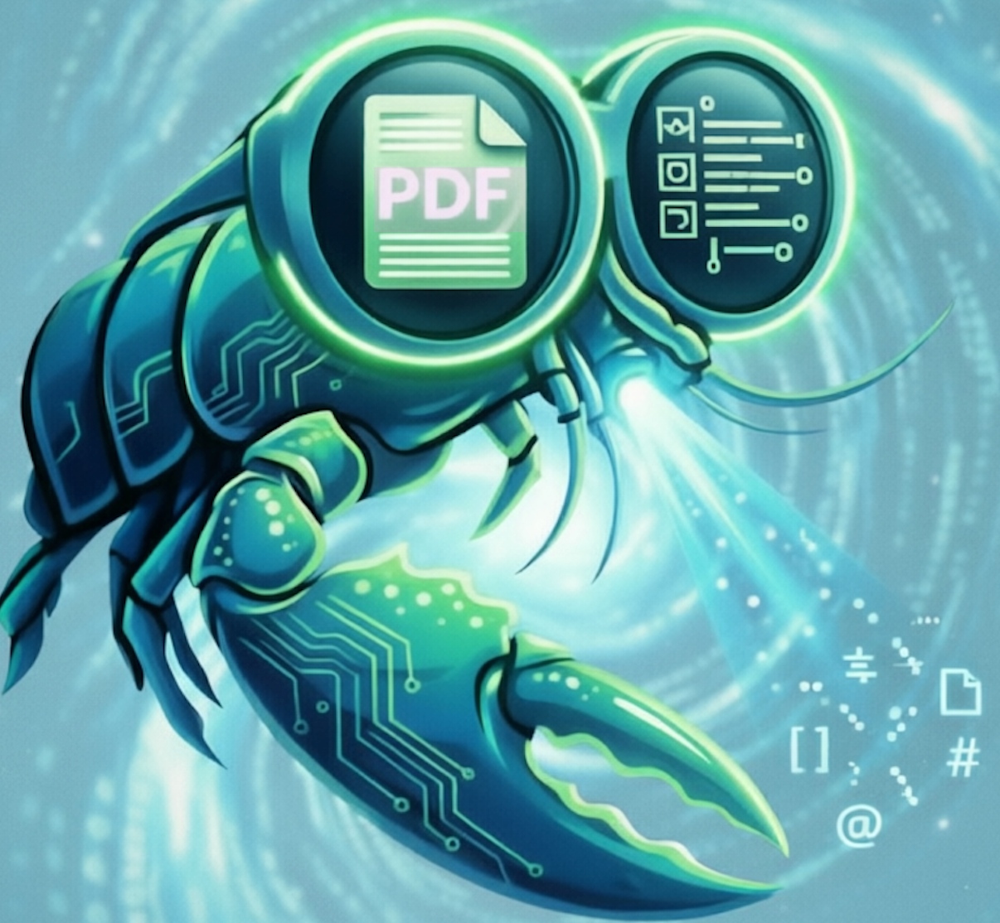

<p align="center">
   &nbsp;<strong style="font-size:1.5em">PPX — 高精度 PDF / 图片解析工具</strong>
</p>

[](https://pypi.org/project/memect-ppx/)
[](https://pypi.org/project/memect-ppx/)
[](https://www.python.org/)
[](LICENSE)
[](https://github.com/memect/ppx/issues)

[English](README.md) | 简体中文

---

**将 PDF 和图片转换为结构化 Markdown / JSON — 本地运行，高精度，生产可用。**

PPX 是一款开源文档解析引擎，专为高保真提取 PDF 和图片中的文本、表格、图形、公式及版面结构而构建。内置 OCR + 版面分析流水线，并可选接入主流大模型后端（DeepSeek-OCR、PaddleOCR-VL、GLM-OCR）。

- **输出格式是什么？** — Markdown 和 JSON；每个对象均携带页面坐标。
- **需要 GPU 吗？** — 不需要。默认后端在 CPU 上运行，GPU（CUDA）为可选项。
- **支持扫描件 PDF 吗？** — 支持。当原生文本缺失时，OCR 自动介入。
- **能用自己的大模型吗？** — 能。通过 `--backend` 接受任意 OpenAI 兼容接口。
- **可嵌入商业产品吗？** — 可以。LGPL-3.0 允许将其作为库链接到商业软件。

---

## 30 秒上手

```bash
pip install memect-ppx onnxruntime opencv-contrib-python
ppx parse document.pdf
```

解析结果写入 `document.pdf.out/doc.md`。

---

## 解决哪些问题？

| 问题 | PPX 的处理方式 |
| ---- | -------------- |
| 含不可见/乱码字符的原生文本 PDF | 检测编码异常，逐页回退到 OCR |
| 无嵌入文本的扫描件 | 整页 OCR 或 vLLM 后端 |
| 跨多列/行的复杂表格 | 基于 LLM 的结构解析，保留 `colspan`/`rowspan` |
| 公式密集的学术论文 | LaTeX 公式提取 |
| 批量处理数千个文件 | 目录级 `parse dir/` 配合 `-o output/` |

---

## 基准测试

后续会在此补充 benchmark 结果与评测脚本说明。

当前 PPX 的 benchmark 评测基于 OmniDocBench 数据集与评测流程：

- 仓库：[OpenDataLab / OmniDocBench](https://github.com/opendatalab/OmniDocBench/tree/main)
- 论文：[OmniDocBench: Benchmarking Diverse PDF Document Parsing with Comprehensive Annotations](https://arxiv.org/abs/2412.07626)

合规说明：

- OmniDocBench 仓库代码采用 Apache-2.0 发布。
- OmniDocBench 同时声明其数据集仅限研究用途，不可用于商业用途。
- 如需复用 benchmark 数据、派生评测产物或对外展示评测结果，请先核对上游数据集条款与版权声明，避免超出许可边界使用。

致谢：

- 感谢 OmniDocBench 作者团队与 OpenDataLab 提供公开 benchmark 与评测工具，支持 PPX 的基准测试工作。

---

## 能力矩阵

| 能力 | 默认（本地） | DeepSeek-OCR | PaddleOCR-VL | GLM-OCR |
| ---- | :---------: | :----------: | :----------: | :-----: |
| 文本提取 | ✅ | ✅ | ✅ | ✅ |
| 字符级坐标 | ✅ | ❌ | ❌ | ❌ |
| 表格结构（colspan / rowspan） | ✅ | ✅ | ✅ | ✅ |
| 公式 → LaTeX | ✅ | ✅ | ✅ | ✅ |
| 图形区域提取 | ✅ | ✅ | ✅ | ✅ |
| 纯 CPU 模式 | ✅ | ✅ | ✅ | ✅ |
| CUDA 加速 | ✅ | ✅ | ✅ | ✅ |
| 无需外部服务 | ✅ | ❌ | ❌ | ❌ |

---

## 如何选择后端？

| 场景 | 推荐后端 |
| ---- | -------- |
| 隐私敏感文档、离网环境 | `default` |
| 复杂版面最高精度 | `deepseek` |
| 精度较好、显存占用较小（~10 GB） | `paddle` |
| 推测解码快速推理 | `glm` |
| 快速集成测试 / CI 流水线 | `default`（CPU） |

---

## 快速开始

### 解析单个文件

```bash
# 自动判断是否需要 OCR
ppx parse report.pdf

# 强制对每页使用 OCR
ppx parse report.pdf --ocr yes

# 完全跳过 OCR
ppx parse report.pdf --ocr no

# 解析图片
ppx parse scan.png
```

### 批量处理

```bash
# 解析目录下所有 PDF 和图片
ppx parse docs/

# 指定输出目录
ppx parse docs/ -o output/
```

### 使用大模型后端

```bash
# DeepSeek-OCR（通过 vLLM 需约 20 GB 显存）
ppx parse report.pdf --backend deepseek \
  --deepseek '{"base_url":"http://127.0.0.1:4000/v1","model":"deepseek-ocr-2","api_key":""}'

# PaddleOCR-VL（需约 10 GB 显存）
ppx parse report.pdf --backend paddle \
  --paddle '{"base_url":"http://127.0.0.1:4001/v1","model":"paddleocr-vl","api_key":""}'

# GLM-OCR（需约 10 GB 显存）
ppx parse report.pdf --backend glm \
  --glm '{"base_url":"http://127.0.0.1:4002/v1","model":"glmocr","api_key":""}'
```

### 持久化配置

频繁使用时，建议将参数写入配置文件，避免每次重复输入：

```bash
mkdir conf
# conf/settings.py（Python dict）或 conf/settings.json
# 参考 src/memect/conf/settings.custom.py
```

```python
# conf/settings.py
settings = {
    "pdf_parser.deepseek.model.base_url": "http://127.0.0.1:4000/v1",
    "pdf_parser.paddle.model.base_url": "http://127.0.0.1:4001/v1",
    "pdf_parser.glm.model.base_url": "http://127.0.0.1:4002/v1",
}
```

配置完成后，只需指定后端即可：

```bash
ppx parse report.pdf --backend deepseek
```

---

## Python API

PPX 可直接作为库使用。`Parser` 设计为一次初始化、多次复用。

### 基础用法

```python
from memect.pdf.base import KDocument, ParseParams
from memect.pdf.parser import Parser

parser = Parser()  # 初始化一次，跨调用复用

doc = KDocument("report.pdf", params=ParseParams())
parser.parse(doc)

print(doc.markdown())   # 完整文档的 Markdown 字符串
data = doc.jsonify()    # 完整文档的 dict（页面 → 带坐标的对象）
```

### 自定义输出目录

```python
doc = KDocument("report.pdf", out_dir="/tmp/out", params=ParseParams())
parser.parse(doc)
# 结果写入 /tmp/out/doc.md 和 /tmp/out/doc.json
```

### 选择后端和 OCR 模式

```python
from memect.pdf.base import Backend, OCRMode

params = ParseParams(
    backend=Backend.DEEPSEEK,
    ocr=OCRMode.AUTO,
    remove_watermark=True,
)
doc = KDocument("report.pdf", params=params)
parser.parse(doc)
```

### 解析指定页面

```python
params = ParseParams(pagenos=[1, 2, 5])   # 1-based 页码
doc = KDocument("report.pdf", params=params)
parser.parse(doc)
```

### 配置 DeepSeek 后端

```python
from memect.pdf.parser import Parser, ParserArgs

args = ParserArgs.create({
    "deepseek": {
        "base_url": "http://127.0.0.1:4000/v1",
        "model": "deepseek-ocr-2",
        "api_key": "",
    }
})
parser = Parser(args)

params = ParseParams(backend=Backend.DEEPSEEK)
doc = KDocument("report.pdf", params=params)
parser.parse(doc)
```

---

## CLI 参考

```text
ppx parse <path> [OPTIONS]

参数：
  path          PDF 文件、图片文件或目录

选项：
  --backend     default | deepseek | paddle | glm   （默认：default）
  --ocr         yes | no | auto                      （默认：auto）
  --table       no | ybk | wbk | auto | llm          （默认：auto）
  --pages       页面范围，例如 "1-5,10
  --mode        page | tree | ppt                    （默认：page）
  -o, --output  输出目录
```

其他子命令：

```text
ppx start               启动 HTTP API 服务
```

---

## 输出格式

每个解析文档写入 `<input>.out/`：

```text
report.pdf.out/
├── doc.md          # 完整文档的 Markdown
├── doc.json        # 完整结构化数据，含每对象坐标
├── pages/          # 逐页拆分（每页一条记录）
└── images/         # 提取的图形/图片（检测到图形时存在）
```

| 路径 | 说明 |
| ---- | ---- |
| `doc.md` | 含图形引用的 Markdown |
| `doc.json` | JSON 树：文档 → 页面 → 对象，每个对象含边界框坐标 |
| `pages/` | 逐页 Markdown 和 JSON，适合页面级处理 |
| `images/` | 提取的图像区域；仅当文档含图形时存在 |

---

## 安装

### 方式一：通过 PyPI 安装（推荐）

```bash
# 创建虚拟环境
uv venv -p 3.12
source .venv/bin/activate

# CPU 版本
uv pip install memect-ppx
uv pip install onnxruntime --no-config
uv pip install opencv-contrib-python --no-config   # 或 opencv-contrib-python-headless

# GPU（CUDA）版本
uv pip install memect-ppx[cuda]
uv pip install onnxruntime-gpu --no-config
uv pip install opencv-contrib-python --no-config
```

> **为什么要单独安装 `onnxruntime` 和 `opencv`？**
> 第三方包经常锁定不同变体（`headless` vs `contrib`、`cpu` vs `gpu`）。
> PPX 将这两个包排除在依赖列表之外，让你自行控制安装哪个变体。

### 方式二：从源码安装

```bash
git clone https://github.com/memect/ppx.git
cd ppx
uv venv -p 3.12
source .venv/bin/activate

# 安装所有依赖（CPU）
uv sync --no-install-project
uv pip install onnxruntime --no-config
uv pip install opencv-contrib-python --no-config

# 或 GPU
uv sync --extra cuda --no-install-project
uv pip install onnxruntime-gpu --no-config
uv pip install opencv-contrib-python --no-config
```

---

## 平台支持

| 平台 | Python | CPU | CUDA | 备注 |
| ---- | ------ | :-: | :--: | ---- |
| Linux | >= 3.12 | ✅ | ✅ | 推荐生产环境 |
| macOS（Apple Silicon） | >= 3.12 | ✅ | ❌ | |
| macOS（Intel） | 3.12 – 3.13 | ✅ | ❌ | 受 OpenVINO 限制 |
| Windows | >= 3.12 | ✅ | ✅ | 社区测试 |

CUDA 需要 NVIDIA 驱动 + CUDA 12.x，以及与该 CUDA 版本匹配的 `onnxruntime-gpu`。

---

## 启动大模型服务

PPX 大模型后端基于 [vLLM](https://github.com/vllm-project/vllm) 部署。

### DeepSeek-OCR-2（约需 20 GB 显存）

```bash
vllm serve ./hub/deepseek-ai/DeepSeek-OCR-2 \
  --served-model-name deepseek-ocr-2 \
  --logits-processors vllm.model_executor.models.deepseek_ocr:NGramPerReqLogitsProcessor \
  --mm-processor-cache-gb 0 \
  --no-enable-prefix-caching \
  --gpu-memory-utilization 0.8 \
  --port 4000
```

### PaddleOCR-VL / PaddleOCR-VL-1.5（约需 10 GB 显存）

```bash
vllm serve ./hub/PaddlePaddle/PaddleOCR-VL \
  --served-model-name paddleocr-vl \
  --trust-remote-code \
  --max-num-batched-tokens 16384 \
  --no-enable-prefix-caching \
  --mm-processor-cache-gb 0 \
  --gpu-memory-utilization 0.5 \
  --port 4001
```

> 也可将 `PaddleOCR-VL` 替换为 `PaddleOCR-VL-1.5`，端口和 `--served-model-name` 保持不变。

### GLM-OCR（约需 10 GB 显存）

```bash
# 需要 transformers >= 5.3.0
uv pip install "transformers>=5.3.0"

vllm serve ./hub/ZhipuAI/GLM-OCR \
  --served-model-name glmocr \
  --max-num-batched-tokens 16384 \
  --max-model-len 16384 \
  --speculative-config '{"method": "mtp", "num_speculative_tokens": 1}' \
  --gpu-memory-utilization 0.5 \
  --port 4002
```

模型来源：[ModelScope — ZhipuAI/GLM-OCR](https://modelscope.cn/models/ZhipuAI/GLM-OCR)

## 常见问题

### PPX 支持加密 PDF 吗？

暂不支持。请先用 `qpdf` 等工具去除密码，再传入 PPX。

### 如何解决 `opencv` 版本冲突？

先卸载所有已有的 opencv 变体，再重新安装：

```bash
uv pip uninstall opencv-python opencv-contrib-python \
                  opencv-python-headless opencv-contrib-python-headless
uv pip install opencv-contrib-python --no-config
```

### `onnxruntime` 和 `onnxruntime-gpu` 能共存吗？

不能。只安装其中一个。GPU 版本必须与系统的 CUDA 版本匹配。

### Mac 上能使用 GPU 加速吗？

不能。Apple Silicon 和 Intel Mac 均不支持 CUDA，两者的 CPU 后端均可正常使用。

### 能将 PPX 嵌入商业产品吗？

可以。LGPL-3.0 允许将 PPX 作为库链接到专有软件中。对 PPX 自身源码的修改须以 LGPL-3.0 协议发布。

### 如何只解析特定页面？

```bash
ppx parse report.pdf --pages "1-5,10,15-20"
```

---

## 贡献

欢迎提交 Bug 报告、功能请求和 Pull Request。

1. Fork 仓库并创建功能分支。
2. 运行测试：`uv run pytest`
3. 提交 PR — 请描述动机并附上测试用例。

详见 [CONTRIBUTING.md](CONTRIBUTING.md)。

---

## 许可证

PPX 基于 [GNU Lesser General Public License v3.0 (LGPL-3.0)](LICENSE) 开源。

LGPL-3.0 允许将本库链接到你的应用中（包括商业应用），无需开放你自己的代码。对 PPX 自身代码的修改须以相同协议共享。

对于仓库内随附的第三方代码与资源，请同时参阅 [NOTICE](NOTICE) 和 [docs/THIRD_PARTY_LICENSES.md](docs/THIRD_PARTY_LICENSES.md)。这两个文件用于说明仓库内 vendored 组件、打包资源的归属信息和发布前的再分发核查事项。
