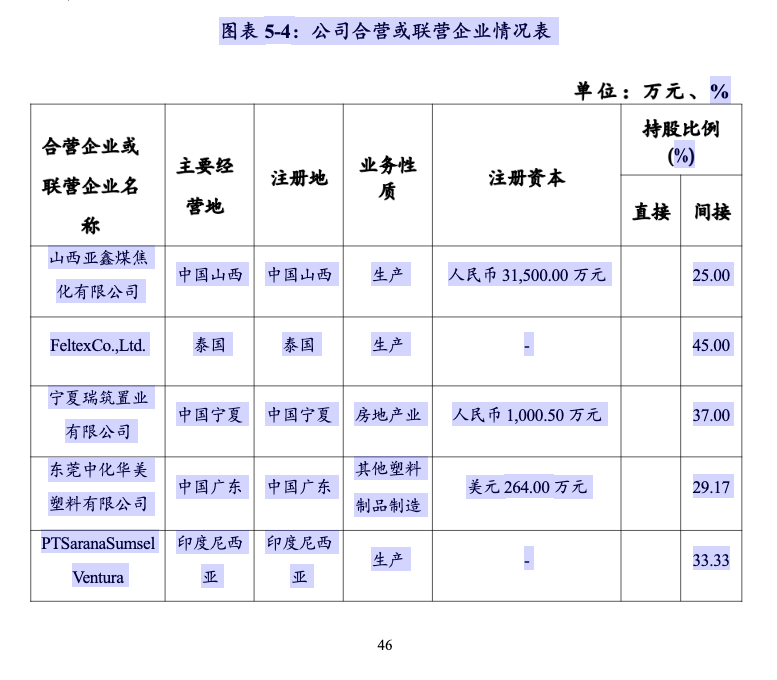
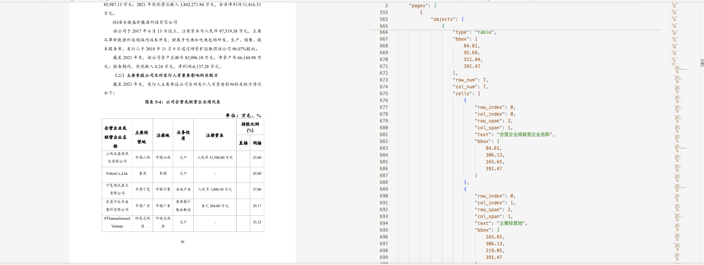
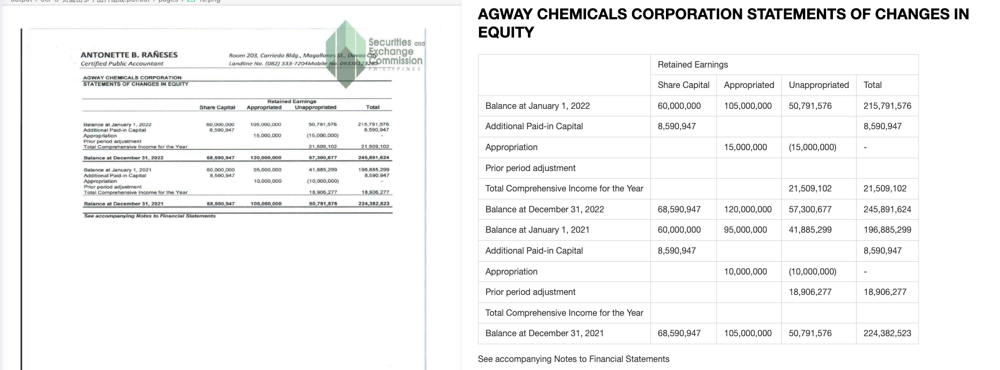
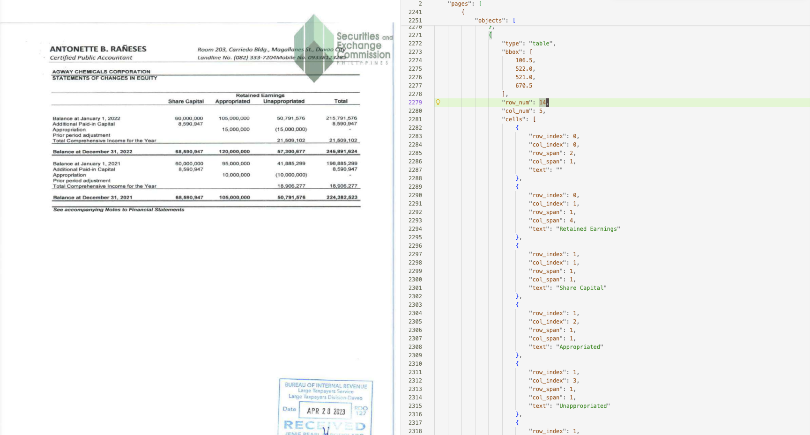
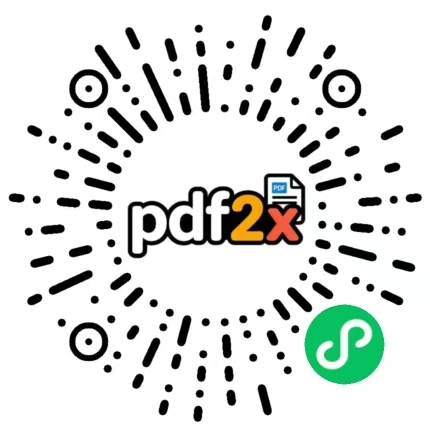

<p align="center">
   &nbsp;<strong style="font-size:1.5em">PPX — 高精度 PDF / 图片解析工具</strong>
</p>

[](https://pypi.org/project/memect-ppx/)
[](https://pypi.org/project/memect-ppx/)
[](https://www.python.org/)
[](LICENSE)
[](https://github.com/memect/memect-ppx/issues)

[English](README.md) | 简体中文

---

**将 PDF 和图片转换为结构化 Markdown / JSON — 本地运行，高精度，生产可用。**

PPX 是一款源码可见的文档解析引擎，专为高保真提取 PDF 和图片中的文本、表格、图形、公式及版面结构而构建。内置 OCR + 版面分析流水线，并可选接入主流大模型后端（DeepSeek-OCR、PaddleOCR-VL、GLM-OCR）。

- **输出格式是什么？** — Markdown 和 JSON；每个对象均携带页面坐标。
- **需要 GPU 吗？** — 不需要。默认后端在 CPU 上运行，GPU（CUDA）为可选项。
- **支持扫描件 PDF 吗？** — 支持。当原生文本缺失时，OCR 自动介入。
- **能用自己的大模型吗？** — 能。通过 `--backend` 接受任意 OpenAI 兼容接口。
- **可嵌入商业产品吗？** — 个人 / 研究 / 非商业用途免费，商用请联系 `contact@memect.co`。

---

## UV安装

```bash
# python >=3.12
$uv venv -p 3.12
#Linux/Mac
$source .venv/bin/activate
#Windows
#.venv\Scripts\activate

#如果下载包很慢，可以如下设置
#export UV_DEFAULT_INDEX=https://pypi.tuna.tsinghua.edu.cn/simple/
$uv pip install memect-ppx
#安装其他依赖包，避免冲突。可选参数，默认: --gpu auto，即有显卡时自动安装对应库；如果不想安装 GPU 相关库，使用 --gpu no
#--gpu auto|no|cuda|cann|dml
#--headless  如果在 docker 等环境中，可能需要这个
$ppx install
#下载依赖模型。模型需要从 HuggingFace 下载，默认已经设置好代理；如需取消或改用其他地址：
#export HF_ENDPOINT=xxx
$ppx download
```

## 源代码方式

```bash
$git clone https://github.com/memect/memect-ppx.git
$cd memect-ppx
$uv venv -p 3.12
#每次代码更新后，建议执行下面 3 个步骤
#如果下载包很慢，可以如下设置
#export UV_DEFAULT_INDEX=https://pypi.tuna.tsinghua.edu.cn/simple/
$uv sync --no-install-project
$./ppx install
$./ppx download
```

## 执行

```bash
#源代码模式，请使用 "./ppx" 替代 "ppx"
#默认解析
$ppx parse a.pdf
#大模型解析，指定url即可，目前仅仅支持deepseek-ocr，paddleocr-vl，glm-ocr等模型
$ppx parse a.pdf --llm http://127.0.0.1:4000/v1
#如果使用的模型的名字不包含deepseek，paddle，glm等，需要指定，如下：
$ppx parse a.pdf --llm '{"name":"deepseek","base_url":"http://127.0.0.1:4000/v1","model":"xxxx","api_key":""}'

#如果经常使用，可以写到配置文件中
$mkdir conf
#可以为json文件或者py文件: settings={}
#参考src/memect/conf/settings.custom.py 语法
$vi conf/settings.py
$vi conf/log.py

#如果在配置文件中写好了路径和模型等，就不需要在命令行再指定
$ppx parse a.pdf --backend deepseek

```

PPX 默认使用 pipeline 模式；指定 `-o output/` 时，解析结果通常写入
`output/doc.md`。

如果还需要导出 HTML，可加上 `--html`。启用后，PPX 会在输出目录中额外生成
`doc.html`。


---

## 解决哪些问题？

| 问题 | PPX 的处理方式 |
| ---- | -------------- |
| 含不可见/乱码字符的原生文本 PDF | 检测编码异常，逐页回退到 OCR |
| 无嵌入文本的扫描件 | 整页 OCR 或 vLLM 后端 |
| 跨多列/行的复杂表格 | 基于 LLM 的结构解析，保留 `colspan`/`rowspan` |
| 公式密集的学术论文 | LaTeX 公式提取 |
| 批量处理数千个文件 | 目录级 `parse dir/` 配合 `-o output/` |

---

## 示例结果

### 图文混合表格

下面这个示例展示了一种较常见的混合场景：表格主体包含可编辑文字，但表头的大部分区域仍然是图片。

输入局部：



Markdown 输出：


JSON 输出：



### 英文扫描件表格

下面这个示例展示了英文扫描件表格的解析结果。

Markdown 输出：



JSON 输出：



---

## 基准测试

详见 [docs/BENCHMARKS.md](docs/BENCHMARKS.md)，其中包含 benchmark 结果、
引用、致谢与合规说明。

---

## 能力矩阵

| 能力 | 默认（本地） | DeepSeek-OCR | PaddleOCR-VL | GLM-OCR |
| ---- | :---------: | :----------: | :----------: | :-----: |
| 文本提取 | ✅ | ✅ | ✅ | ✅ |
| 字符级坐标 | ✅ | ❌ | ❌ | ❌ |
| 表格结构（colspan / rowspan） | ✅ | ✅ | ✅ | ✅ |
| 公式 → LaTeX | ✅ | ✅ | ✅ | ✅ |
| 图形区域提取 | ✅ | ✅ | ✅ | ✅ |
| 纯 CPU 模式 | ✅ | ✅ | ✅ | ✅ |
| CUDA 加速 | ✅ | ✅ | ✅ | ✅ |
| 无需外部服务 | ✅ | ❌ | ❌ | ❌ |

---

## 如何选择后端？

| 场景 | 推荐后端 |
| ---- | -------- |
| 隐私敏感文档、离网环境 | `default` |
| 复杂版面最高精度 | `deepseek` |
| 精度较好、显存占用较小（~10 GB） | `paddle` |
| 推测解码快速推理 | `glm` |
| 快速集成测试 / CI 流水线 | `default`（CPU） |

---

## 快速开始

### 默认 pipeline 模式

```bash
ppx parse <input_path> -o <output_path>

# 示例
ppx parse report.pdf -o output/
```

## GPU 加速

1. OCR
   4090 会快一些；2080、3090 可能比现代 CPU 慢。

2. Table
   GPU 通常快 3-5 倍。

3. Layout
   GPU 通常快 3-5 倍。

4. Formula
   GPU 会快几倍，复杂公式场景可达到十几倍。因此，如果文档中有大量公式，建议在 GPU 下执行，或通过 `--formula http://xxx/v1` 配置使用大模型（Paddle / GLM）。

   也可以指定本地公式识别后端：

   ```bash
   --formula mfr   # GPU 快，CPU 慢
   --formula pp    # GPU 慢，CPU 快
   --formula no    # 不将公式转换为 LaTeX
   ```

### 解析单个文件

```bash
# 自动判断是否需要 OCR
ppx parse report.pdf

# 强制对每页使用 OCR
ppx parse report.pdf --ocr yes

# 完全跳过 OCR
ppx parse report.pdf --ocr no

# 解析图片
ppx parse scan.png

# 同时导出 HTML
ppx parse report.pdf -o output/ --html
```

### 解析表格

```bash
# 使用无边框表格识别（wbk）解析含表格的图片，结果输出到 output/
ppx parse table_color_zh.png --table wbk -o output/
```

`--table` 可选值：

| 值 | 说明 |
|----|------|
| `no` | 跳过表格识别 |
| `ybk` | 有线表格（默认推荐） |
| `wbk` | 无线/复杂表格 |
| `auto` | 自动选择（默认） |
| `llm` | 使用大模型解析表格 |

### 批量处理

```bash
# 解析目录下所有 PDF 和图片
ppx parse docs/

# 指定输出目录
ppx parse docs/ -o output/
```

### 使用大模型后端

```bash
# DeepSeek-OCR（通过 vLLM 需约 20 GB 显存）
ppx parse report.pdf --backend deepseek \
  --deepseek '{"base_url":"http://127.0.0.1:4000/v1","model":"deepseek-ocr-2","api_key":""}'

# PaddleOCR-VL（需约 10 GB 显存）
ppx parse report.pdf --backend paddle \
  --paddle '{"base_url":"http://127.0.0.1:4001/v1","model":"paddleocr-vl","api_key":""}'

# GLM-OCR（需约 10 GB 显存）
ppx parse report.pdf --backend glm \
  --glm '{"base_url":"http://127.0.0.1:4002/v1","model":"glmocr","api_key":""}'
```

### 持久化配置

频繁使用时，建议将参数写入配置文件，避免每次重复输入：

```bash
mkdir conf
# conf/settings.py（Python dict）或 conf/settings.json
# 参考 src/memect/conf/settings.custom.py
```

```python
# conf/settings.py
settings = {
    "pdf_parser.deepseek.model.base_url": "http://127.0.0.1:4000/v1",
    "pdf_parser.paddle.model.base_url": "http://127.0.0.1:4001/v1",
    "pdf_parser.glm.model.base_url": "http://127.0.0.1:4002/v1",
}
```

配置完成后，只需指定后端即可：

```bash
ppx parse report.pdf --backend deepseek
```

---

## Python 调用

PPX 可直接作为库使用。`Parser` 设计为多次调用时全局只需要一个对象。

```python
from memect.pdf.parser import Parser
from memect.pdf.base import KDocument, KDocumentFactory

# 如果需要多次使用，全局只需要一个对象
# 如果没有传递参数，使用默认的设置
with Parser() as parser:
    doc = KDocument("/path/your.pdf")
    parser.parse(doc)

# 多进程批量，使用默认的设置
doc = KDocumentFactory("/path/your.pdf", params=None)
docs = [doc]
Parser.batch(docs, max_workers=1)
```

---

## CLI 参考

```text
ppx parse <path> [OPTIONS]

参数：
  path          PDF 文件、图片文件或目录

选项：
  --backend     default | deepseek | paddle | glm   （默认：default）
  --ocr         yes | no | auto                      （默认：auto）
  --table       no | ybk | wbk | auto | llm          （默认：auto）
  --html        输出 HTML 文件（`doc.html`）
  --json        输出结构化 JSON 文件（`doc.json`）
  --pages       页面范围，例如 "1-5,10"
  --mode        page | tree                  （默认：page）
  -o, --output  输出目录
```

HTML 示例：

```bash
./ppx parse example/专利证书_1.pdf -o output/ --html
```

其他子命令：

```text
ppx start               启动 HTTP API 服务
```

## 输出格式

每个解析文档写入 `<input>.out/`：

```text
report.pdf.out/
├── doc.md          # 完整文档的 Markdown
├── doc.html        # 开启 --html 时额外生成的 HTML
├── doc.json        # 完整结构化数据，含每对象坐标
├── pages/          # 逐页拆分（每页一条记录）
└── images/         # 提取的图形/图片（检测到图形时存在）
```

| 路径 | 说明 |
| ---- | ---- |
| `doc.md` | 含图形引用的 Markdown |
| `doc.html` | 通过 `--html` 生成的可预览 / 可导出的 HTML |
| `doc.json` | JSON 树：文档 → 页面 → 对象，每个对象含边界框坐标 |
| `pages/` | 逐页 Markdown 和 JSON，适合页面级处理 |
| `images/` | 提取的图像区域；仅当文档含图形时存在 |

---

## 平台支持

| 平台 | Python | CPU | CUDA | 备注 |
| ---- | ------ | :-: | :--: | ---- |
| Linux | >= 3.12 | ✅ | ✅ | 推荐生产环境 |
| macOS（Apple Silicon） | >= 3.12 | ✅ | ❌ | |
| macOS（Intel） | 3.12 – 3.13 | ✅ | ❌ | 受 OpenVINO 限制 |
| Windows | >= 3.12 | ✅ | ✅ | 社区测试 |

CUDA 需要 NVIDIA 驱动 + CUDA 12.x，以及与该 CUDA 版本匹配的 `onnxruntime-gpu`。

---

## Docker 部署

```bash
cp .env.sample .env
docker compose up -d --build
```

如果本机构建访问 Debian 官方源较慢，可只在构建阶段设置镜像源：

```bash
DEBIAN_MIRROR=https://mirrors.aliyun.com/debian \
PYPI_INDEX_URL=https://mirrors.aliyun.com/pypi/simple \
docker compose build ppx
```

CUDA 镜像默认把 `onnxruntime-gpu` 固定到 `PPX_ONNXRUNTIME_GPU_VERSION=1.23.2`，避免新版 wheel 需要 CUDA 13 动态库而当前安装的是 CUDA 12 Python 运行库。

GPU 服务需要宿主机已安装 NVIDIA Container Toolkit，可用 compose profile 启动：

```bash
COMPOSE_PROFILES=gpu PPX_GPU_IMAGE=hub.wenyinhulian.cn/docparser/ppx-gpu:260702 PPX_GPU_DEVICE_ID=0 docker compose up -d ppx-gpu
```

多卡机器上可用 `PPX_GPU_DEVICE_ID=0` 选择宿主机显卡。

正式 Linux GPU 镜像建议用脚本构建，默认产出 `hub.wenyinhulian.cn/docparser/ppx-gpu:<YYMMDD>`，例如 `hub.wenyinhulian.cn/docparser/ppx-gpu:260702`：

```bash
DEBIAN_MIRROR=https://mirrors.cloud.tencent.com/debian \
PYPI_INDEX_URL=https://mirrors.aliyun.com/pypi/simple \
scripts/build-gpu-image.sh
```

脚本同时会打一个本机便捷 alias `ppx:gpu`。发布到私有镜像仓库时可在 Docker 已登录后执行：

```bash
scripts/build-gpu-image.sh --push
```

需要固定 tag 时可显式指定：

```bash
PPX_IMAGE_TAG=260702 scripts/build-gpu-image.sh
```

默认启动一个 `ppx` API/Web 服务，容器内监听 `9527`，宿主端口由 `PPX_PORT` 控制。常用挂载目录：

- `PPX_DATA_DIR_HOST`：上传、任务和错误文件，默认 `./data`
- `PPX_LOG_DIR_HOST`：日志目录，默认 `./logs`
- `PPX_CONF_DIR_HOST`：可选配置目录，默认 `./conf`，需要覆盖默认配置时放 `settings.py`

常用运行变量：

- `PPX_LOG_LEVEL`：日志级别，默认 `INFO`
- `PPX_CPU`：强制 CPU，可设 `all`、`ocr`、`layout`、`table`、`formula`
- `PPX_FORMULA`：公式识别模型，默认 `formula-pp`，也可设 `formula-mfr`、`paddle`、`glm`

PDF 服务目录、文件限制、任务队列等业务配置不建议继续堆环境变量；按项目约定在 `conf/settings.py` 里只覆盖需要改的配置项。例如：

```python
settings = {
    "pdf_service.data_dir": "./data/pdf",
    "pdf_service.task_manager.max_running_size": 4,
    "pdf_service.pdf.max_page_count": 2000,
}
```

外部大模型服务通过 URL 配置：`PPX_DEEPSEEK_URL`、`PPX_PADDLE_URL`、`PPX_GLM_URL`、`PPX_BAIDU_URL`。如果模型服务跑在宿主机，Docker 内可使用 `http://host.docker.internal:<port>/v1`；如果跑在同一 compose 网络，改成对应服务名。

安全上不建议把该服务直接暴露到公网。当前 `/api/parse`、`/api/parse/state`、`/admin/gc` 等接口未做鉴权，生产环境应放在内网或反向代理鉴权之后。

---

## 启动大模型服务

PPX 大模型后端基于 [vLLM](https://github.com/vllm-project/vllm) 部署。

```bash
# 常用环境变量，可以附加在命令前面
export CUDA_VISIBLE_DEVICES=0
# 国内建议使用 ModelScope，下面的模型 ID 也是相对 ModelScope，HuggingFace 的可能有所不同
export VLLM_USE_MODELSCOPE=True
```

### DeepSeek-OCR-2（约需 20 GB 显存）

[ModelScope](https://modelscope.cn/models/deepseek-ai/DeepSeek-OCR-2) — 注意：vllm==0.19.1 会产生乱码，请使用更新版本。

```bash
vllm serve deepseek-ai/DeepSeek-OCR-2 \
  --served-model-name deepseek-ocr-2 \
  --logits-processors vllm.model_executor.models.deepseek_ocr:NGramPerReqLogitsProcessor \
  --mm-processor-cache-gb 0 \
  --no-enable-prefix-caching \
  --gpu-memory-utilization 0.8 \
  --port 4000
```

### PaddleOCR-VL / PaddleOCR-VL-1.5（约需 10 GB 显存）

[ModelScope PaddleOCR-VL](https://modelscope.cn/models/PaddlePaddle/PaddleOCR-VL) · [PaddleOCR-VL-1.5](https://modelscope.cn/models/PaddlePaddle/PaddleOCR-VL-1.5)

```bash
# PaddleOCR-VL
vllm serve PaddlePaddle/PaddleOCR-VL \
  --served-model-name paddleocr-vl \
  --trust-remote-code \
  --max-num-batched-tokens 16384 \
  --no-enable-prefix-caching \
  --mm-processor-cache-gb 0 \
  --gpu-memory-utilization 0.5 \
  --port 4001

# PaddleOCR-VL-1.5（模型名、端口号相同，配置无需改变）
vllm serve PaddlePaddle/PaddleOCR-VL-1.5 \
  --served-model-name paddleocr-vl \
  --trust-remote-code \
  --max-num-batched-tokens 16384 \
  --no-enable-prefix-caching \
  --mm-processor-cache-gb 0 \
  --gpu-memory-utilization 0.5 \
  --port 4001
```

### GLM-OCR（约需 10 GB 显存）

[ModelScope](https://modelscope.cn/models/ZhipuAI/GLM-OCR)

```bash
vllm serve ZhipuAI/GLM-OCR \
  --served-model-name glmocr \
  --max-num-batched-tokens 16384 \
  --max-model-len 16384 \
  --speculative-config '{"method": "mtp", "num_speculative_tokens": 1}' \
  --gpu-memory-utilization 0.5 \
  --port 4002
```

## 训练布局模型

```bash
#可以clone ppx或者安装ppx，在当前目录上安装PaddleX
$cd ppx
$git clone https://github.com/PaddlePaddle/PaddleX.git
#国内走代理
$git clone https://gh-proxy.org/https://github.com/PaddlePaddle/PaddleX.git

$cd Paddlex
$uv venv -p 3.12
$source .venv/bin/activate
#查看官方文档安装对应的gpu版本
$uv pip install paddlepaddle-gpu==3.3.0 --index-url https://www.paddlepaddle.org.cn/packages/stable/cu126/
$uv pip install -e ".[base]"
$uv pip install pip
#安装plugin
$paddlex install PaddleOCR


#安装labelme，标注图片
$uv tool install labelme

#把需要训练的图片放在images目录下
$mkdir -p layout-project/images

#生成预标注，支持"l","plus_l"模型
$./ppx train layout l --dir layout-project

$cd layout-project & labelme images --labels label-l.txt --output labelme-l

#执行训练
$./ppx train layout l --dir layout-project --device gpu:0  --export-onnx

$./ppx train layout l --dir layout-project 

```

---

## 常见问题

### PPX 支持加密 PDF 吗？

暂不支持。请先用 `qpdf` 等工具去除密码，再传入 PPX。

### 如何解决 `opencv` 版本冲突？

先卸载所有已有的 opencv 变体，再重新安装：

```bash
uv pip uninstall opencv-python opencv-contrib-python \
                  opencv-python-headless opencv-contrib-python-headless
uv pip install opencv-contrib-python --no-config
```

### Linux 服务器上出现 `ImportError: libGL.so.1`

改用 headless 版本的 OpenCV：

```bash
uv pip install opencv-python-headless
```

或安装系统库：`sudo apt-get install -y libgl1`

### `onnxruntime` 和 `onnxruntime-gpu` 能共存吗？

不能。只安装其中一个。GPU 版本必须与系统的 CUDA 版本匹配。

### Mac 上能使用 GPU 加速吗？

不能。Apple Silicon 和 Intel Mac 均不支持 CUDA，两者的 CPU 后端均可正常使用。

### 能将 PPX 嵌入商业产品吗？

默认协议下不可以。PPX 对个人 / 研究 / 非商业用途免费；商用请联系 `contact@memect.co`。

### 如何只解析特定页面？

```bash
ppx parse report.pdf --pages "1-5,10,15-20"
```

---

## 产品体验

pdf2x 产品网页端体验：<https://pdf2x.cn/>

[免费申请 API KEY](https://pdf2x.cn/api/apikey/page) 实现接口调用。

小程序体验：



---

## 贡献

欢迎提交 Bug 报告、功能请求和 Pull Request。

1. Fork 仓库并创建功能分支。
2. 运行测试：`uv run pytest`
3. 提交 PR — 请描述动机并附上测试用例。

详见 [CONTRIBUTING.md](CONTRIBUTING.md)。

---

## Star History

<a href="https://www.star-history.com/?repos=memect%2Fmemect-ppx&type=date&legend=top-left">
 <picture>
   <source media="(prefers-color-scheme: dark)" srcset="https://api.star-history.com/chart?repos=memect/memect-ppx&type=date&theme=dark&legend=top-left" />
   <source media="(prefers-color-scheme: light)" srcset="https://api.star-history.com/chart?repos=memect/memect-ppx&type=date&legend=top-left" />
   
 </picture>
</a>

---

## 许可证

PPX 基于 [PolyForm Noncommercial License 1.0.0](LICENSE) 发布。

个人 / 研究 / 非商业用途免费；商用请联系 `contact@memect.co`。

对于仓库内随附的第三方代码与资源，请同时参阅 [NOTICE](NOTICE) 和 [docs/THIRD_PARTY_LICENSES.md](docs/THIRD_PARTY_LICENSES.md)。这两个文件用于说明仓库内 vendored 组件、打包资源的归属信息和发布前的再分发核查事项。
