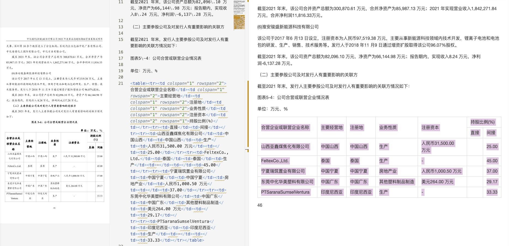

# 我们开源了 PPX：一个面向真实文档场景的 PDF / 图片解析引擎

文档一直是企业知识、业务流程和信息系统的重要输入，但文档处理这件事，远不只是“把 PDF 里的文字提出来”这么简单。

在真实场景中，文档往往混合了原生文本、扫描图片、复杂表格、多栏排版、页眉页脚、脚注、图形和公式。对于大语言模型应用、知识库系统、RAG 预处理、Agent 文档接入这类场景来说，真正需要的也不是一段失去结构的纯文本，而是可以继续被程序消费、检索、切分、引用和重建的结构化结果。

基于这样的判断，我们决定开源 PPX。

PPX 是一个面向真实文档场景的 PDF / 图片解析引擎，支持将输入文档转换为结构化 Markdown 和 JSON，并尽可能保留文本、表格、图形、公式、页面坐标和版面层次信息。它既可以作为本地命令行工具使用，也可以作为 Python 库或服务能力集成到更大的文档理解系统中。

PPX 的中文表达借用了“皮皮虾”这个名字。我们希望它像皮皮虾一样，在复杂信息环境中高速感知、精准捕捉，并将混乱内容拆解为结构化数据。

## 为什么要做 PPX

过去几年里，我们越来越频繁地遇到这样一类问题：文档已经成为知识系统和大语言模型系统的核心输入，但上游文档解析能力往往并不稳定。

例如：

- 知识库系统需要把文档转成可切分、可检索、可引用的数据结构
- RAG 系统需要高质量的预处理和结构化抽取，而不是简单的文本拼接
- Agent 在消费 PDF、报告、合同、财报、论文时，需要更稳定的上下文和结构信息
- 扫描件、图文混排文档、乱码 PDF、复杂表格、公式密集型文档，都很难通过“纯文本提取”解决

如果缺少一层足够稳定的文档解析能力，下游的大模型能力、知识系统能力和自动化流程能力就很难真正落地。

PPX 想解决的，正是这个问题。

## PPX 提供什么能力

PPX 主要面向 PDF 和图片文档，输出 Markdown、JSON 等结构化结果，并保留页面对象级坐标信息，适合继续用于下游处理。

当前核心能力包括：

- 文本提取与 OCR 自动切换
- 图文混排文档解析
- 表格结构识别，保留 `colspan` / `rowspan`
- 公式提取并转为 LaTeX
- 页面对象级坐标输出
- 本地默认后端与多种大模型后端切换

我们希望它不仅“能解析”，而且“解析结果能继续被使用”。

## 一个更直观的例子

下面是一组来自实际用例的局部示意图，展示一种在真实业务中比较常见、也比较难处理的混合场景：表格主体中有可编辑文字，但表头的大部分区域仍然是图片。

这类文档如果只做纯文本提取，通常会丢失表头信息；如果只当作整块图片处理，又会损失表格主体中原本可直接使用的文本内容。PPX 的目标是在这类场景下尽可能同时保留结构和可用内容。

### 输入文档局部


### Markdown 输出示意



### JSON 输出示意


从这个例子可以看到，PPX 的目标并不是只导出一段文本，而是在“文字和图片混合存在于同一张表格中”的情况下，尽可能把文档内容转换成更适合程序处理的结构化表示。

## 再看一个扫描件表格的例子

除了图文混合表格，扫描件表格也是实际场景中非常常见的一类输入。对这类文档来说，难点通常不在于“有没有文字”，而在于扫描质量、版面结构、表格边界和内容重建是否稳定。

下面这组示意图展示的是英文扫描件表格解析结果：

### Markdown 输出示意


### JSON 输出示意


这一类场景更贴近很多知识库录入、历史资料数字化、报表归档和批量文档处理需求。对于大语言模型、RAG 和知识系统而言，只有把扫描件中的表格尽可能恢复成可继续处理的结构，后续的检索、切分和问答链路才会更稳定。

## 为什么它更适合当前的热点场景

今天很多团队在做的事情，本质上都依赖文档结构化这一步。

包括但不限于：

- 大语言模型应用中的文档接入
- 企业知识库建设
- RAG 文档预处理
- Agent 的知识消费和外部文档访问
- 报告、论文、合同、财报等复杂 PDF 解析
- 文档服务化和批量处理流水线

这些场景的共同点是：需要的不只是“看起来有内容”，而是“结果足够稳定、足够可消费、足够适合下游系统继续处理”。

PPX 的设计也围绕这个目标展开。

## 设计思路

PPX 采用“默认本地解析 + 可选大模型增强”的双路径设计。

对于隐私敏感、离线部署、快速接入场景，可以直接使用默认本地后端；对于复杂版面、高精度识别场景，也可以切换到 DeepSeek-OCR、PaddleOCR-VL、GLM-OCR 等后端。

这种设计的意义在于：

- 适配不同部署环境，而不是强绑定单一推理栈
- 在成本、精度、速度之间做更现实的工程权衡
- 让开发者先低门槛跑通，再按需升级复杂能力

## 基础用法

PPX 同时支持 `uv` 和 `pip` 安装。

使用 `uv`：

```bash
uv pip install memect-ppx onnxruntime opencv-contrib-python
```

使用 `pip`：

```bash
pip install memect-ppx onnxruntime opencv-contrib-python
```

默认 pipeline 模式解析：

```bash
ppx parse <input_path> -o <output_path>
```

例如：

```bash
ppx parse report.pdf -o output/
```

也可以直接解析单个文件、图片或目录：

```bash
ppx parse document.pdf
ppx parse scan.png
ppx parse docs/ -o output/
```

常见参数示例：

```bash
# 自动判断是否需要 OCR
ppx parse report.pdf

# 强制 OCR
ppx parse report.pdf --ocr yes

# 跳过 OCR
ppx parse report.pdf --ocr no

# 指定页码范围
ppx parse report.pdf --pages "1-5,10,15-20"
```

默认输出通常会写到 `<input>.out/` 或你通过 `-o` 指定的目录中，便于后续继续处理。

## 项目入口

- GitHub: <https://github.com/memect/memect-ppx>
- 产品站: <https://pdf2x.cn/>
- 小程序: `#小程序://PDF2x/fXZ4o2YV4BwU7Vg`

如果希望快速体验，可以直接使用产品站或小程序；如果希望本地部署、二次开发或集成到自己的系统中，可以使用开源仓库和 PyPI 包。

## 为什么选择现在开源

我们希望 PPX 不只是一个内部可用工具，而是一个能够在更广泛文档场景中被验证、被改进、被复用的开源基础能力。

开源的意义在于：

- 让更多开发者能直接试用、部署和接入
- 让问题暴露得更充分，能力迭代得更快
- 让文档解析这类底层能力更透明、更可复现
- 让这个项目逐步沉淀成可持续维护的基础设施

## 欢迎一起参与

如果你正在做下面这些方向，欢迎关注和参与 PPX：

- 大语言模型文档接入
- 知识库和 RAG 预处理
- Agent 的文档消费与知识访问
- OCR 和文档理解
- 复杂 PDF 解析
- 表格恢复与结构化输出

你可以通过这些方式参与：

- 提交 Issue 反馈问题和需求
- 提交 Pull Request 改进能力或文档
- 补充公开可分发的测试样例
- 分享真实使用场景和效果反馈

我们希望 PPX 不只是一个能跑起来的工具，而是一个能够在真实文档场景中长期生长、持续演进的开源项目。

